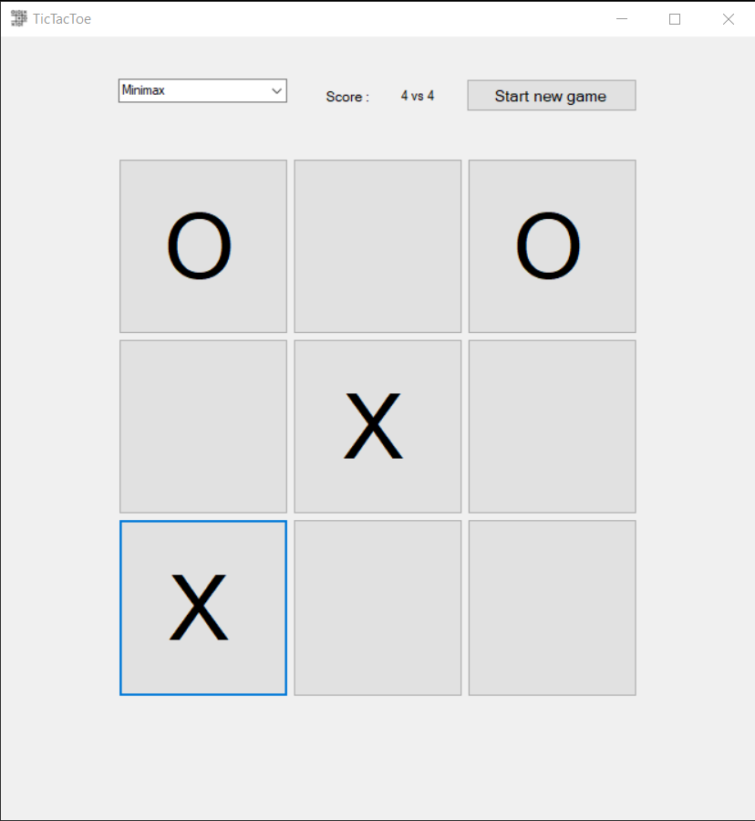

# TicTacToe

*TicTacToe MiniMax* is a project that I did to practice the *Minimax* algorithm. 

The project was built using *Winforms* as it gave me a way of building the interface more easily. 

### The game has 3 levels of difficulty.

- For the first level , the game chooses the next move randomly. This level is the easiest as it is driven by chance. The model can win but the chances are low.

- For the second level, the game chooses the next move by looking one step ahead. At first, it checks if it can win in one move. If not, it checks if the opponent might win within the next move and blocks the player if so. Otherwise, the model chooses an option randomly. This level is definitely more difficult than the first but it is still possible to win. 

- For the third and final level, the game chooses the next move by applying the Minimax algorithm. This level is completely unbeatable. The algorithm predicts all possible moves and their outcome by building a *Possibility Tree* of all future moves. The algorithm predicts not only its future moves but also the opponent's. Therefore it can choose the best outcome by predicting traps set by player many steps ahead. For that reason, this algorithm is 100% unbeatable. 

Nevertheless, the third algorithm does have a weakness: it does not prioritise winning with less moves. As long as the algorithm wins, it picks the first option that it finds. This does not affect its score but it does affect the amount of moves it takes to win.

---

### Here is a video showcasing the application : 

  (Click on the image to open the youtube video)

